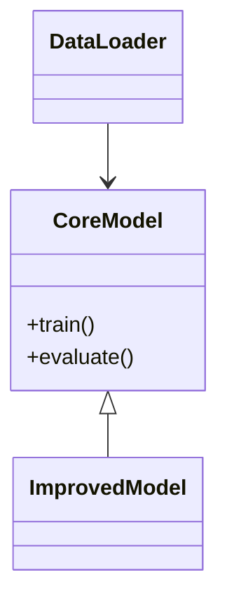

# Thesis Artifact Reproduction Guide  
**Thesis Title:** `UNDERSTANDING PORTABILITY OF CONFIGURATION TESTING FOR OPEN-SOURCE JAVA PROJECTS`  
**Affiliation:** University of Illinois at Urbana-Champaign  
**Last Verified:** 2025-03-10  

---

## 1. Metadata  
```yaml
# Project Identification
doi: 10.XXXX/XXXXXX  
jel_classification: [JEL Code]  
keywords: [Keyword1], [Keyword2], [Keyword3]  
repository: https://github.com/[username]/[repo]  
```

---

## 2. Environment Configuration  
### 2.1 Dependency Installation  
```bash
# Create conda environment
docker pull xxx/ta_image:xxx
docker run -it ta_image

# Core dependencies
pip install -r requirements.txt
```

### 2.2 Software Requirements  
| Component       | Version  | Verification Command       |  
|-----------------|----------|----------------------------|  
| PyTorch         | 2.1.0    | `python -c "import torch; print(torch.__version__)"` |  
| CUDA Toolkit    | 12.1     | `nvcc --version`           |  

---

## 3. Data Management  
### 3.1 Source Data  
```markdown
- ​**Primary Dataset**: [Dataset Name]  
  - Source: [DOI/URL]  
  - Access: [Public/Restricted]  
  - File: `data/raw/[filename].csv`

- ​**Supplementary Data**:  
  ```bash
  # Download script
  wget https://example.org/dataset.zip -P data/external/
  ```
```

### 3.2 Processed Data  
```python
# data_processing.py
def clean_dataset(input_path: str, output_path: str):
    """Main data cleaning function"""
    ...
```

---

## 4. Code Architecture  
```text
project-root/
├── src/
│   ├── models/
│   │   └── model.py          # CoreModel class definition
│   ├── analysis/
│   │   └── experiment.py    # run_experiment() entry point
├── notebooks/
│   └── exploratory/
│       └── data_analysis.ipynb
```

---

## 5. Execution Workflow  
### 5.1 Full Reproduction  
```bash
# Complete pipeline execution
python -m src.analysis.experiment \
  --config configs/main.yaml \
  --log-dir runs/experiment_1
```

### 5.2 Component Execution  
```python
# Modular execution example
from src.models.model import CoreModel

model = CoreModel(hidden_size=256)
model.train(dataset="processed/train.csv")
```

---

## 6. Validation & Testing  
```bash
# Run test suite
pytest tests/ --cov=src --cov-report=html

# Expected output verification
[Output] Validation accuracy: 0.85 ± 0.02 (mean ± std)
```

---

## 7. Documentation  
### 7.1 Key Class Relationships  


### 7.2 Parameter Matrix  
| Parameter       | Training Value | Validation Value |  
|-----------------|----------------|------------------|  
| Learning Rate   | 0.001          | 0.0005           |  
| Batch Size      | 128            | 256              |  

---

## 8. Compliance Checklist  
- [ ] Data citation matches README specifications[1](@ref)  
- [ ] All analysis files are in open formats (.csv, .txt)[1](@ref)  
- [ ] Variable labels exist in dataset metadata[1](@ref)  
- [ ] Codebook matches dataset structure  

---

## 9. Troubleshooting  
> ​**Common Issue**: Dimension mismatch in tensor operations  
> ​**Solution**: Verify input preprocessing matches model expectations  

```diff
- input_shape = (256, 256)
+ input_shape = (224, 224)
```

---

## References  
[1](@ref): [AEA Data Editor Replication Template](https://aeadataeditor.github.io/aea-de-guidance/)  
[2](@ref): [ICPSR Data Management Guidelines](https://www.icpsr.umich.edu)  
