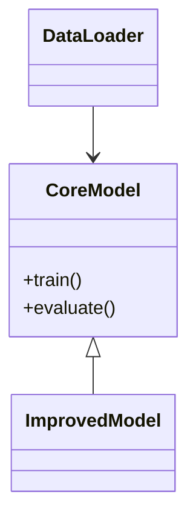

# Thesis Artifact Reproduction Guide  
**Thesis Title:** `UNDERSTANDING PORTABILITY OF CONFIGURATION TESTING FOR OPEN-SOURCE JAVA PROJECTS`  
**Affiliation:** University of Illinois at Urbana-Champaign  
**Last Verified:** 2025-03-10  

---

## 1. Metadata
### 1.1 Source Code and Repository
Ctest4J: [Annotation Library](https://github.com/xlab-uiuc/ctest4j/tree/auto_annotate)
A Ctest4J module for automatic processing of target projects and running of Ctests.

Ctest-repos: [Target Projects](https://github.com/ctest-repos)
Contains studied projects with ported and unsuitable ones.

### 1.2 Projects Studied
```json
{
"//comment": "project_supported",
"hbase-server": "../app/hbase/hbase-server",
"alluxio-core-common": "../app/alluxio/core/common",
"hive-common": "../app/hive/common",
"camel-core": "../app/camel/core",
"yarn-common": "../app/hadoop/hadoop-yarn-project/hadoop-yarn/hadoop-yarn-common",
"mapreduce-client-core": "../app/hadoop/hadoop-mapreduce-project/hadoop-mapreduce-client/hadoop-mapreduce-client-core",
"flink-core": "../app/flink/flink-core",
"kylin-core-common": "../app/kylin/core-common",
"zeppelin-interpreter": "../app/zeppelin/zeppelin-interpreter"
}

{
"//comment": "projects_unsupported",
"druid-processing": "../app/druid",
"kafka": "../app/kafka",
"rocketmq-common": "../app/rocketmq/common",
"spark-core": "../app/spark/core",
"tomcat": "../app/tomcat",
"redisson": "../app/redisson",
"nifi-commons": "../app/nifi/nifi-commons",
"netty-common": "../app/netty/common",
"spring-framework": "../app/spring-framework"
}
```

---

## 2. Setup  
### 2.1 Start a Docker container  
```bash
# pull and start a docker container
docker pull xxx/ta_image:xxx
docker run -it --name ta_test ta_image:xxx /bin/bash
```

### 2.2 Set up Ctest4J
```bash
# clone the Ctest4J repo (need to setup ssh first)
cd /home/ctestrunner
git clone git@github.com:xlab-uiuc/ctest4j.git

# switch to the branch for thesis evaluation
cd ctest4j
git checkout auto_annotate
```
| Component       | Version  | Verification Command       |  
|-----------------|----------|----------------------------|  
| PyTorch         | 2.1.0    | `python -c "import torch; print(torch.__version__)"` |  
| CUDA Toolkit    | 12.1     | `nvcc --version`           |  


### 2.3 Prepare target projects
```bash
mkdir app && cd app
git clone {target_project_repo_url}

# checkout the instrumented version
# (for flink, checkout commit aa83fa3d)
cd {target_project_repo}
git checkout ctest-eval

# prepare snapshot dependencies (for Zeppelin Only, only need the parent POM and zeppelin-common module)
cd zeppelin && mvn clean install -DskipTests && cd ../../scripts
```
## 3. Validation
### 3.1 Run Ctest
```bash
# use annotation library to automatically run Ctests in tracking and checking modes, mapping files between tests and parameters are generated
# example: python3 auto_annotate.py hive-common junit4 ../app/hive/common . ctest/saved_mapping ({project_test_dir} usually can be ".")
python3 auto_annotate.py {project_name} {test_module} {project_dir} {project_test_dir} {ctest_mapping_dir}
```

### 3.2 Run evaluation scripts
```bash
python3 xxx
```


## 3. Data Management  
### 3.1 Source Data  
```markdown
- ​**Primary Dataset**: [Dataset Name]  
  - Source: [DOI/URL]  
  - Access: [Public/Restricted]  
  - File: `data/raw/[filename].csv`

- ​**Supplementary Data**:  
  ```bash
  # Download script
  wget https://example.org/dataset.zip -P data/external/
  ```
```

### 3.2 Processed Data  
```python
# data_processing.py
def clean_dataset(input_path: str, output_path: str):
    """Main data cleaning function"""
    ...
```

---

## 4. Code Architecture  
```text
project-root/
├── src/
│   ├── models/
│   │   └── model.py          # CoreModel class definition
│   ├── analysis/
│   │   └── experiment.py    # run_experiment() entry point
├── notebooks/
│   └── exploratory/
│       └── data_analysis.ipynb
```

---

## 5. Execution Workflow  
### 5.1 Full Reproduction  
```bash
# Complete pipeline execution
python -m src.analysis.experiment \
  --config configs/main.yaml \
  --log-dir runs/experiment_1
```

### 5.2 Component Execution  
```python
# Modular execution example
from src.models.model import CoreModel

model = CoreModel(hidden_size=256)
model.train(dataset="processed/train.csv")
```

---

## 6. Validation & Testing  
```bash
# Run test suite
pytest tests/ --cov=src --cov-report=html

# Expected output verification
[Output] Validation accuracy: 0.85 ± 0.02 (mean ± std)
```

---

## 7. Documentation  
### 7.1 Key Class Relationships  


### 7.2 Parameter Matrix  
| Parameter       | Training Value | Validation Value |  
|-----------------|----------------|------------------|  
| Learning Rate   | 0.001          | 0.0005           |  
| Batch Size      | 128            | 256              |  

---

## 8. Compliance Checklist  
- [ ] Data citation matches README specifications[1](@ref)  
- [ ] All analysis files are in open formats (.csv, .txt)[1](@ref)  
- [ ] Variable labels exist in dataset metadata[1](@ref)  
- [ ] Codebook matches dataset structure  

---

## 9. Troubleshooting  
> ​**Common Issue**: Dimension mismatch in tensor operations  
> ​**Solution**: Verify input preprocessing matches model expectations  

```diff
- input_shape = (256, 256)
+ input_shape = (224, 224)
```

---

## References  
[1](@ref): [AEA Data Editor Replication Template](https://aeadataeditor.github.io/aea-de-guidance/)  
[2](@ref): [ICPSR Data Management Guidelines](https://www.icpsr.umich.edu)  
